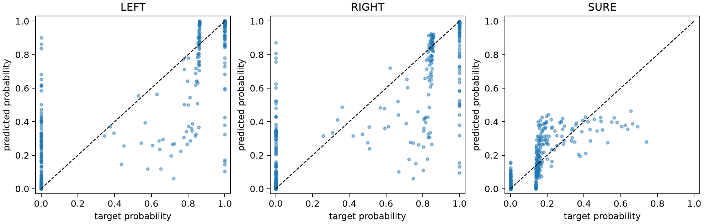
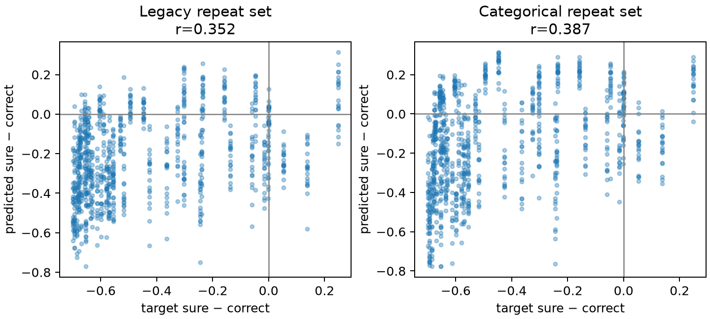
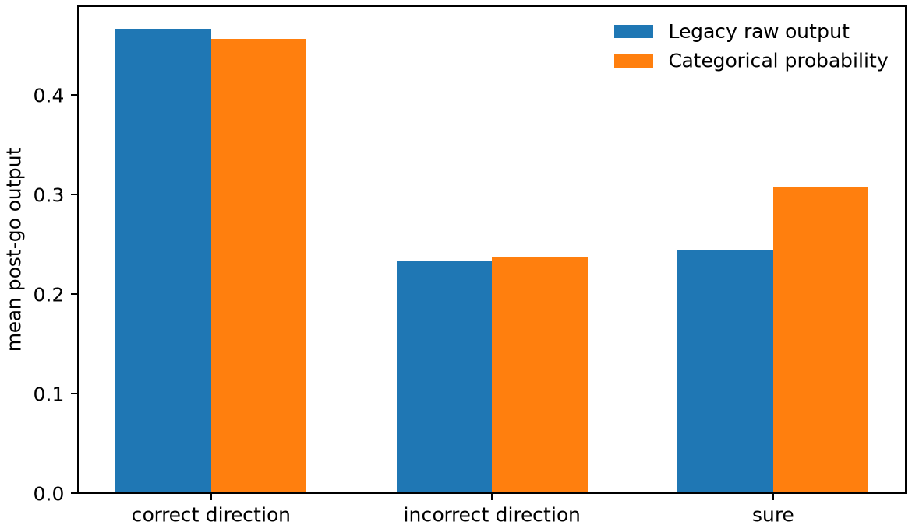
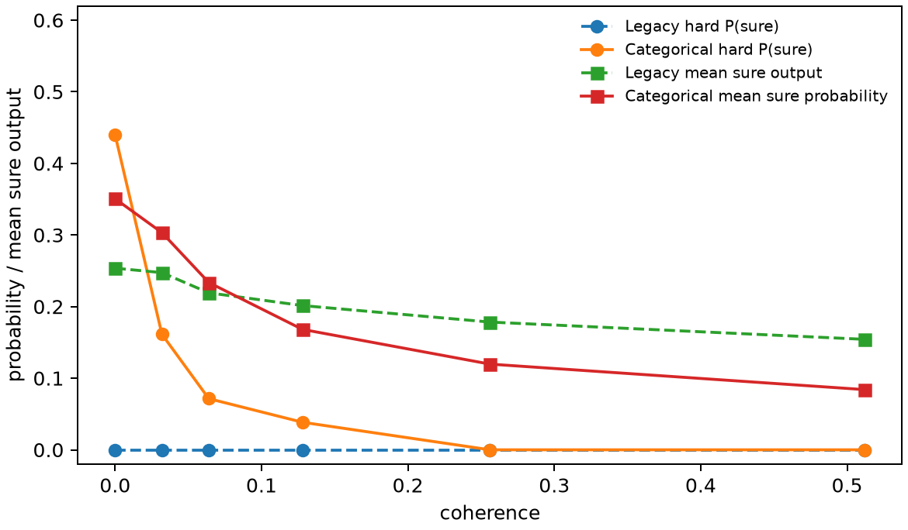
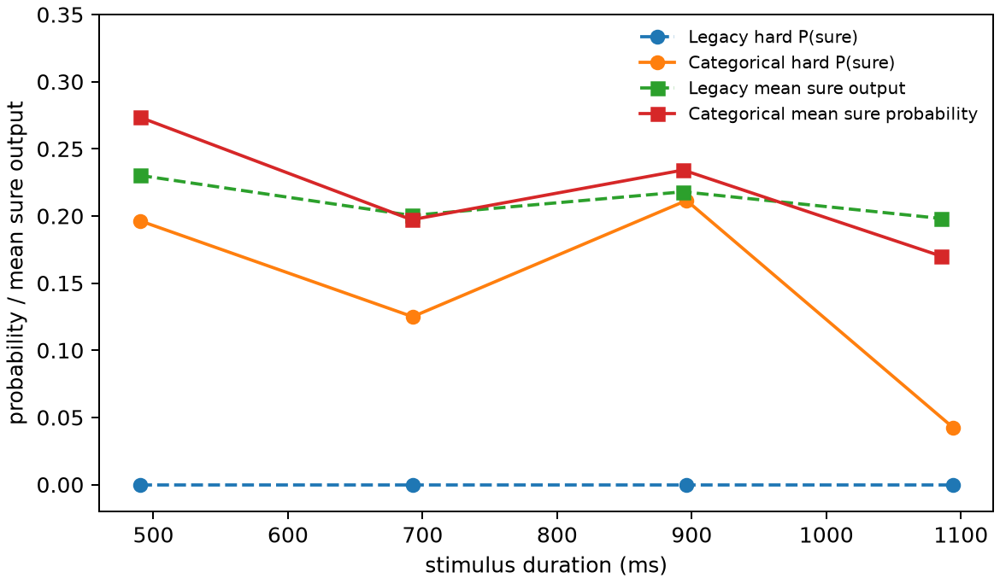

# Seed-7 categorical student-objective experiment

## Decision

**Mixed result; not ready to freeze for population analysis.** The categorical objective fixed the literal zero-sure failure, preserved direction behavior, and improved some soft-fidelity measures. It did not faithfully reproduce the sparse teacher policy: it overexpressed sure, did not reduce matched-repeat incorrect-direction mass, worsened matched-repeat margin-sign agreement, and left substantial post-go fixation output.

No teacher was trained or modified. The frozen input dataset remained byte-identical before and after the run:

```text
data/model_freeze/teacher_seed7.npz
SHA-256 8ab578794710ab3fd142107f1ad2d14172742e149525ac894c8305b68fbcf94d
```

The experiment remained on `feature/model-freeze-validation`. The worktree already contained the uncommitted model-freeze implementation and generated artifacts, so creating `experiment/student-categorical-objective` would only have relabeled a mixed dirty state. `main` remained at baseline commit `32e5a2a577344b4f3c9170b5512e42a81de50796` and was not checked out, modified, merged, or rebased.

## Controlled objective change

PsychRNN Basic has four unconstrained linear outputs: fixation, left, right, and sure. The legacy control uses

```text
L_legacy = mean_{batch,time,channel} [mask * (prediction - target)]².
```

After go, the existing targets are `[fixation, left, right, sure]`:

```text
left-correct:  [0, 1-s, 0, s]
right-correct: [0, 0, 1-s, s]
```

The legacy hard choice averages the first 10 post-go output steps and applies `argmax` across all four channels.

The optional `categorical_soft` objective retains every masked-MSE element except post-go left/right/sure. If `g=1` where the three action targets sum to one, the new loss is

```text
L_categorical = mean[(1 - g_action) * {mask * (prediction - target)}²]
              + (1/4) mean_{batch,time}[g * CE(q, softmax(action_logits))].
```

The factor `1/4` preserves PsychRNN's original outer normalization over four outputs. Pre-go action supervision and fixation MSE are unchanged. Fixation remains targeted to 1 before go and 0 after go, but it is never included in the post-go action softmax. Categorical behavior averages post-go action probabilities and uses `argmax(left, right, sure)` only.

The default remains `independent_mse`; legacy behavior does not silently change.

## Primary comparison

The standard comparison uses the same first 400 sequential dataset trials (203 sure-offered). The earlier legacy run did not save left/right/fixation on standard trials, so metrics requiring those channels use the identical saved 48-stimulus × 20-repeat offered set and are labeled accordingly.

| Metric | Legacy student | Categorical student |
|---|---:|---:|
| teacher sure-favoring fraction, standard offered | 5.91% (12/203) | 5.91% (12/203) |
| hard P(sure \| offered), standard | 0.00% (0/203) | 14.78% (30/203) |
| target/predicted sure correlation, standard | 0.451 | 0.559 |
| target/predicted action-margin correlation, matched repeat | 0.352 | 0.387 |
| action-margin sign agreement, matched repeat | 79.58% | 68.65% |
| incorrect-direction output, matched repeat | 0.2335 | 0.2363 |
| post-go fixation output, standard | not saved | 0.3758 |
| no-sure direction accuracy, standard | 90.36% | 93.40% |
| offered-but-direction-choice accuracy, standard | 82.18% | 89.02% |

The categorical standard action distribution has cross-entropy `0.4675`, KL divergence `0.2236`, and per-action MAE `0.1069`. On the matched repeat set, categorical cross-entropy is `0.9750` versus a diagnostic legacy value of `1.0022`; the legacy number requires clipping its independent scores at zero and renormalizing them and is therefore not a native legacy probability loss. Matched-repeat action MAE is `0.2049` categorical versus `0.1988` legacy after that same projection.





## Target fidelity

Among 203 offered standard trials:

- teacher sure-favoring: 12 (5.91%);
- categorical predicted sure-favoring: 45 (22.17%);
- categorical hard sure choices: 30 (14.78%).

On the 12 teacher sure-favoring trials, mean target sure was `0.6120`, mean predicted sure was `0.3712`, and mean predicted correct-direction probability was `0.3241`. Eight of 12 (66.67%) were expressed as a predicted sure preference. Across offered trials, standard action-margin correlation was `0.598`, bias `(predicted-target)` was `+0.144`, and sign agreement was `79.80%`.

This fixes zero-sure behavior but overshoots the teacher's hard preference prevalence by about 2.5×. “More sure” is therefore not itself a success.

## Incorrect direction and fixation

Categorical incorrect-direction probability on standard trials was:

| subset | N | mean incorrect-direction probability |
|---|---:|---:|
| sure offered | 203 | 0.1326 |
| no sure | 197 | 0.0967 |
| teacher sure-favoring | 12 | 0.3048 |
| teacher direction-favoring | 191 | 0.1218 |

The standard legacy channels were not saved, so the defensible direct comparison is the matched repeat set: `0.2335` legacy versus `0.2363` categorical. The intervention therefore did **not** demonstrate reduced residual incorrect-direction output on matched inputs.

Mean categorical post-go fixation output was `0.3758` (mean absolute output also `0.3758`) despite a zero target. Fixation cannot interfere with categorical choice because it is excluded from both softmax and argmax, but its failure to suppress is scientifically concerning and prevents treating the head as cleanly solved.



## Hard action behavior and safety

Across all 400 standard trials, categorical choices were left `44.0%`, right `48.5%`, and sure `7.5%`. Among offered trials, P(sure) was `14.78%`, compared with the teacher-implied `5.91%` for those exact trials.

Direction behavior was preserved:

- no-sure accuracy improved from `90.36%` to `93.40%`;
- offered-but-direction-choice accuracy improved from `82.18%` to `89.02%`.

Categorical P(sure | offered) by coherence `[0, .032, .064, .128, .256, .512]` was `[.440, .161, .071, .038, 0, 0]`. By duration bins `400–600`, `600–800`, `800–1000`, and `1000–1190 ms`, it was `[.196, .125, .212, .043]`.





## Soft confidence structure

On sure-offered standard trials, predicted categorical sure probability correlated with:

| variable | Pearson r |
|---|---:|
| teacher sure_strength | +0.559 |
| empirical P(correct) | -0.660 |
| internal margin | -0.811 |
| coherence | -0.708 |
| stimulus duration | -0.246 |

The intended uncertainty structure remains present and is stronger than the legacy sure-target correlation (`0.451`). Coherence ordering is clear. Duration is weaker and non-monotonic in the four hard-choice bins, so the duration relationship should not be overinterpreted.

## Repeated-stimulus check

The categorical evaluation used 48 offered stimuli × 20 repeats, matching the control:

- stochastic hard sure frequency: `16.67%` categorical versus `0.21%` legacy;
- stimuli with sure/direction switching: `33/48` categorical versus `2/48` legacy;
- noise=0 repeats were exactly stable: all-repeat consistency `1.0`, maximum output difference `0`, maximum state difference `0`;
- deterministic noise=0 hard sure frequency was `8.33%` (4 of 48 unique stimuli; repeated rows give the same fraction);
- within variable categorical stimuli, pre-TS margin predicted later sure choice with fixed-effects logit coefficient `-16.47` (SE `1.57`); hidden PC1 coefficient was `-0.718` (SE `0.124`).

The selected repeat set emphasizes teacher-boundary stimuli and is not a prevalence estimate. It does show that stochastic recurrent activity now crosses the categorical boundary frequently, while deterministic inference is stable.

## Interpretation

1. **Did categorical competition fix zero-sure failure?** Yes in the literal sense: 30/203 offered standard trials chose sure instead of 0/203.
2. **Did it improve fidelity?** Partially. Standard sure correlation improved (`0.451 → 0.559`) and matched-repeat margin correlation improved slightly (`0.352 → 0.387`), but the hard sure rate overshot the teacher, matched-repeat sign agreement worsened, and repeat action MAE did not improve.
3. **Did it reduce incorrect-direction residual?** No on the matched repeat control (`0.2335 → 0.2363`).
4. **Did it preserve direction behavior?** Yes; both no-sure and offered-direction accuracy improved.
5. **Main remaining limitation?** Both. The teacher policy remains sparse (5.23% sure-favoring over all 516 offered dataset trials), while the categorical student overexpresses that policy and retains poor nonchosen/fixation geometry.
6. **Ready to move on?** The objective hypothesis has been tested, but this student is not yet a clean frozen model for population analysis. A separate reward-policy experiment is scientifically justified next, provided it remains separate from a follow-up student-head calibration/fixation pass; reward changes should not be used to hide the current student mismatch.

## Reproducibility and artifacts

Exact training command:

```bash
PYTHONPATH=src:analysis MPLCONFIGDIR=/tmp/mpl TF_CPP_MIN_LOG_LEVEL=2 /private/tmp/rdm-model-freeze-env/bin/python scripts/run_timed_student.py --dataset data/model_freeze/teacher_seed7.npz --seed 7 --student-action-objective categorical_soft --training-iters 50000 --loss-epoch 1000 --n-batch 50 --n-rec 50 --n-eval-batches 8 --repeated-n-stimuli 48 --repeated-n-repeats 20 --deterministic-eval-rec-noise 0 --summary results/model_freeze/student_categorical_seed7/summary.json --weights results/model_freeze/student_categorical_seed7/weights.npz --post-go-outputs results/model_freeze/student_categorical_seed7/post_go_outputs.csv --focused-action-eval
```

Training wall time was `25.04 s` (`19.35 s` reported inside PsychRNN's optimization loop; `2.60 s` initialization). Evaluation followed in the same process.

Underlying outputs:

- `student_categorical_seed7/post_go_outputs.csv`: all four standard post-go channels, targets, choices, and requested metadata;
- `student_categorical_seed7/comparison_summary.json`: complete numerical comparison;
- `student_categorical_seed7/comparison_metrics.csv`: compact table;
- `student_categorical_seed7/soft_structure_bins.csv`: coherence/duration bins;
- `student_categorical_seed7/summary_repeated_stimulus_trials.csv` and deterministic counterpart: 48×20 evaluations;
- `student_categorical_seed7/weights.npz`: categorical student checkpoint.

Tests: `60 passed` with two third-party Python 3.14 deprecation warnings.

Legacy artifacts under `results/model_freeze/multiseed/timed_seed7_summary*` were read only and not overwritten.
